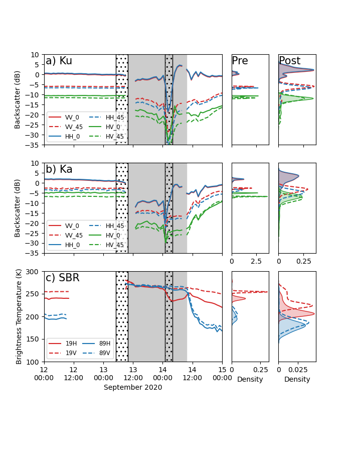

# mosaic_rain_on_snow
This repository contains code to create snow and meteorological, and microwave plots for MOSAiC rain on snow paper.

### Data

Data used to generate these plots were collected as part of the MOSAiC expedition.

### Code

Code is in the `source/` folder.

`source/plot_snowdata_and_met.py` generates Figure 1.  
`source/plot_mosaic_microwave_closeup.py` generates Figure ?  
`source/plot_microwave.py` generates an earlier version of Figure ? that shows a longer time period.

### Images

Image files are in `figures/`

  
Figure 1.  a) 2 m air temperature, snow surface temperature, and bulk snow pack temperature; b) hydrometeor maximum diameter and precipitation rate; c) hydrometeor fall speed; d) snow density from density cutter and micro-CT, and snow grain specific surface area; e) snow water equivalent (SWE).  Stippled regions show periods of observed precipitation.  Light grey regions show periods of above-freezing temperatures.

  
Figure ?.  a) co-polarized and cross polarized backscatter (dB) for 0^o and 45^o view(?) angles for Ku band radar.  b) same as a) but for Ka band radar.  c) Brightness temperatures (K) for 19 and 89 GHz horizontal and vertical polarizations for SBR radiometer.  Side panels show kernel density estimates of backscatter distributions before (PRE) and after (POST) rain on snow event.   Stipple and shading are same as in Figure 1.

  
Figure ?x.  Same as Figure ? but for extended time period. 
