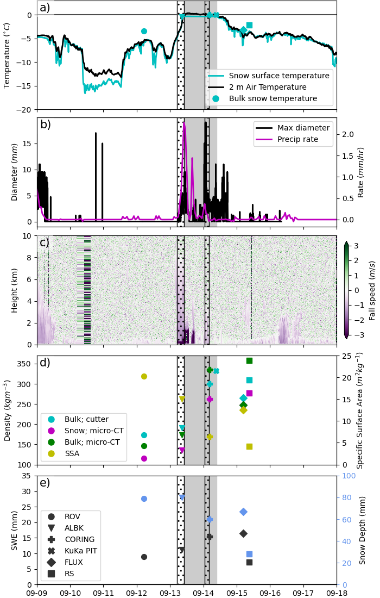
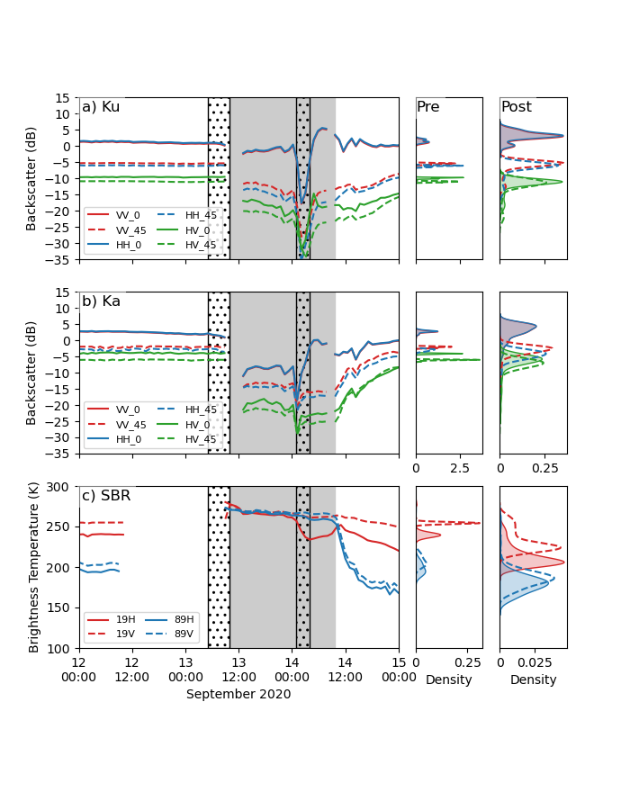
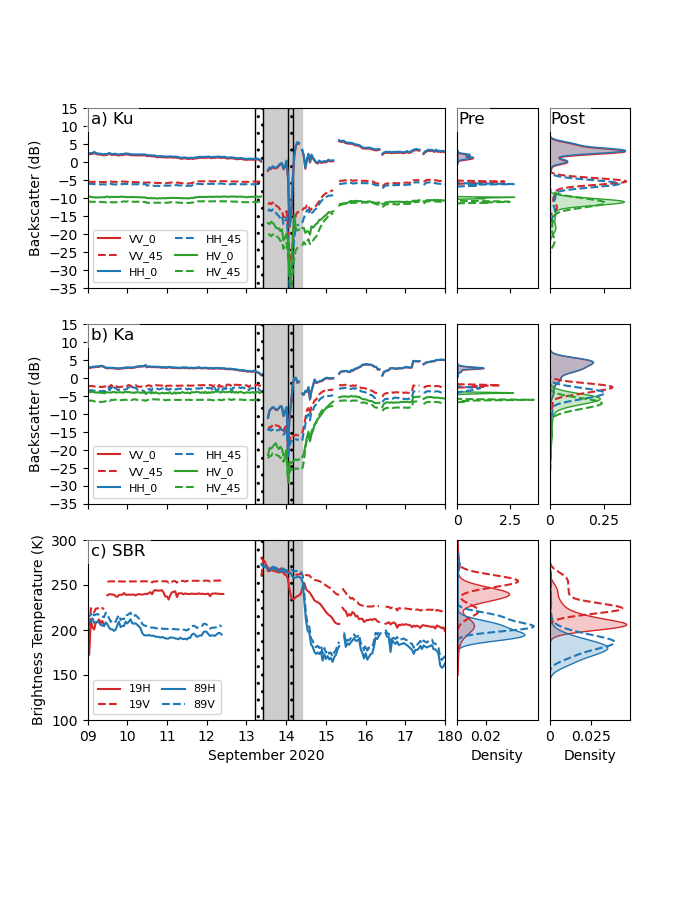

# mosaic_rain_on_snow
This repository contains code to create snow and meteorological, and microwave plots for MOSAiC rain on snow paper.

Code is in the `source` folder.

`source/plot_snowdata_and_met.py` generates Figure 1.  
`source/plot_mosaic_microwave_closeup.py` generates Figure ?  
`source/plot_microwave.py` generates an earlier version of Figure ? that shows a longer time period.

Image files are in `images`

